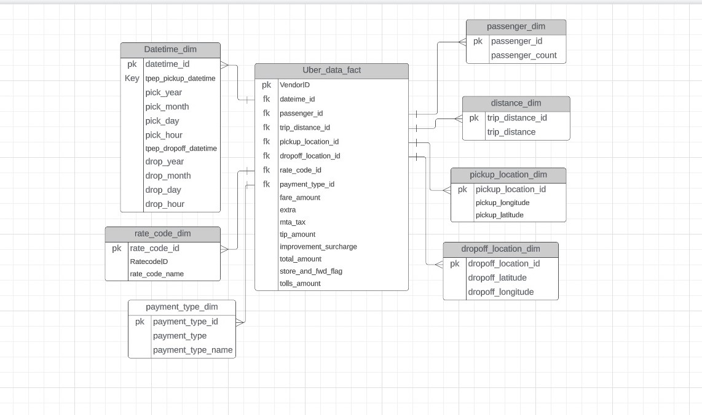

# Uber-Database-Design
Scalable Database design for Uber

The objective of this project was to design a scalable database for Uber using the star schema model to create a well structured database. 
The project entails an ETL Using python for the extraction and transformation of the data and then Pg Admin4 for the load part. The data was fully deployed to a PostgreSQL database.

